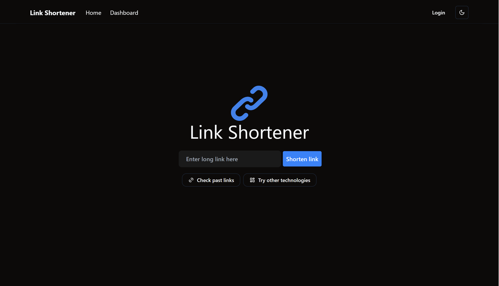
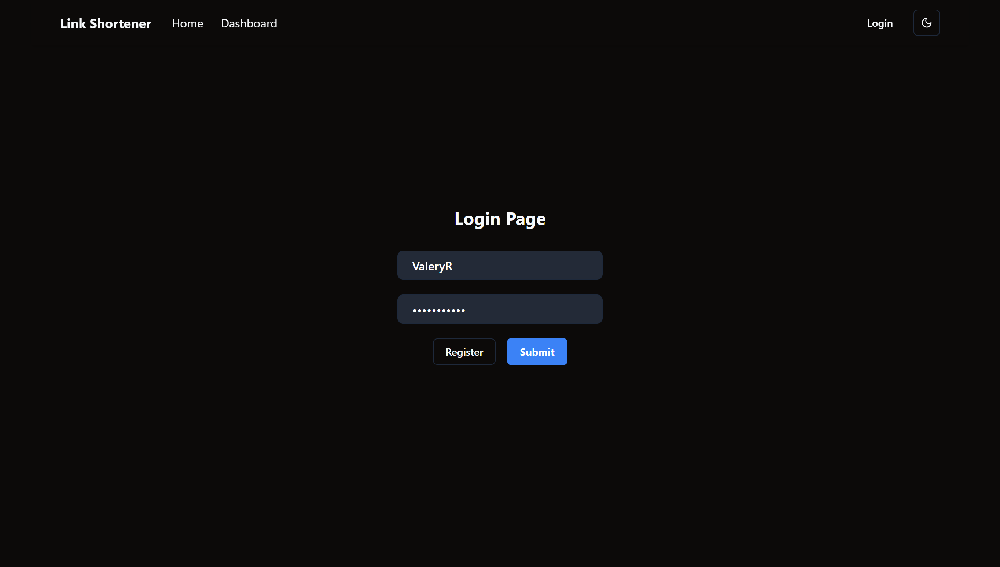
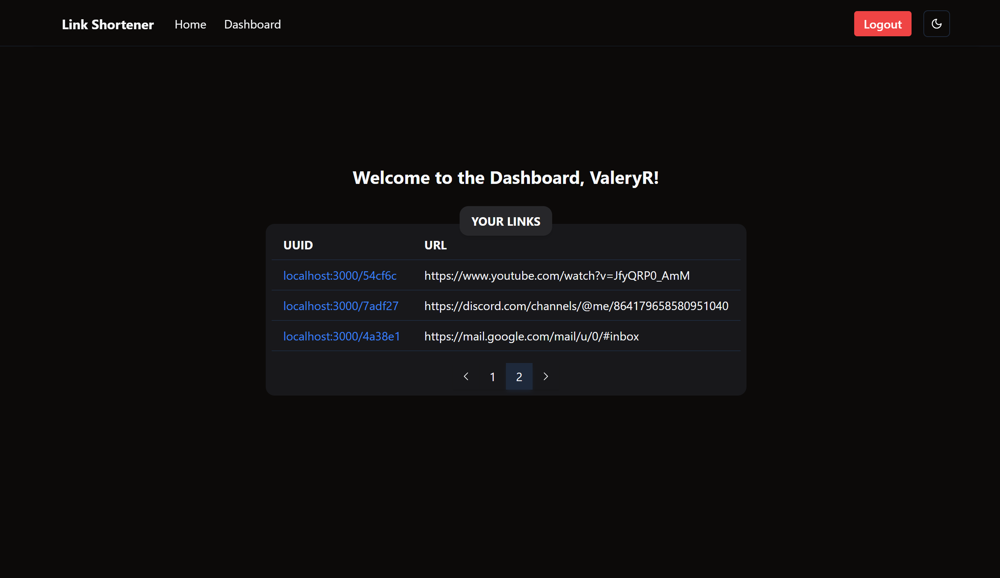

# ✂️ Link Shortener
Link Shortener is a modern web application that allows users to shorten URLs and manage them through an intuitive user panel. The platform provides a user-friendly interface, secure authentication, and a history of generated links, all stored in a database.

## 🚀 Features
- URL Shortening – Quickly generate short links for long URLs.
- Login & Registration Panel – Secure user authentication system.
- CAPTCHA-Protected Registration – Prevents bot registrations using CAPTCHA verification.
- Shortened Links History – All generated links are stored in a database and accessible in the user panel.
- Responsive Design – Optimized for both desktop and mobile devices.
- Built with React & React Router – Ensuring smooth navigation and high performance.
  
## 📸 Screenshots

    
    

## ℹ FAQ

### ❓ How does Link Shortener work?
The app allows users to generate short URLs that redirect to their original destinations.

### 🔐 Is registration required?
Yes, registration is necessary to access the history of shortened links.

### 🛡 How does CAPTCHA security work?
During registration, users must complete a CAPTCHA test to prevent mass bot sign-ups.

### 📁 Where are the shortened links stored?
All links are stored in a database and can be accessed through the user panel.

### 📱 Is the app mobile-friendly?
Yes! Link Shortener is fully responsive and works on any device.
